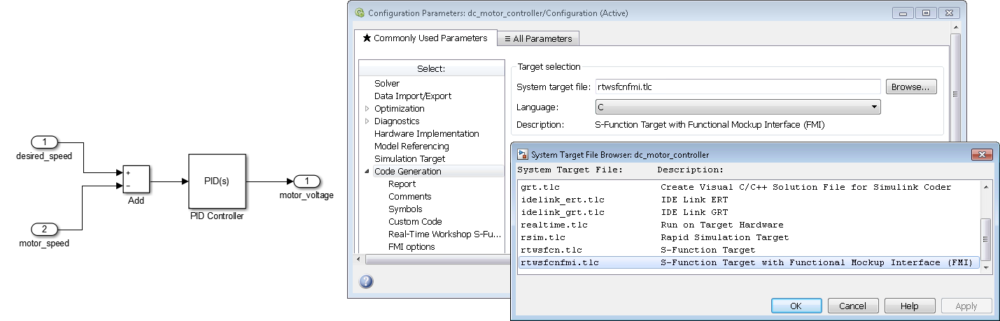

# FMU Export

FMI Kit provides two Simulink Coder targets to export Simulink models as FMUs:

- `grtfmi.tlc` (based on the Generic Real-Time target)
- `rtwsfcnfmi.tlc` (based on the S-function target)

The table below gives an overview of the different capabilities:

|                  |      GRT        |   S-Function    |
|------------------|:---------------:|:---------------:|
| MATLAB Version   | R2012b - R2019a | R2012b - R2018b |
| Model References |      yes        |       no        |
| Source Code      |      yes        |       no        |
| Co-Simulation    |      yes        |      yes        |
| Model Exchange   |       no        |      yes        |
| Requires CMake   |      yes        |       no        |

**Supported compilers**

`grtfmi.tlc`: all compilers supported by [CMake](https://cmake.org/)

`rtwsfcnfmi.tlc`: all Visual Studio versions supported by MATLAB on Windows or GCC on Linux

## Exporting an FMU

To export a Simulink model as an FMU

- open the model to export (e.g. type `f14` in the command window)
- add external inputs and outputs (optional)
- open **Simulation > Model Configuration Parameters** (CTRL+E)
- under **Solver > Type** select **Fixed-step** for a Co-Simulation FMU or **Variable-step** for a Model Exchange FMU
- under **Code Generation > System target file** click **Browse** and select **grtfmi.tlc** for a Generic Real-Time based FMU or **rtwsfcnfmi.tlc** for an S-function based FMU
- set the respective FMI options (optional)
- apply the **Model Configuration Parameters** dialog
- select **Code > C/C++ Code > Build Model** (CTRL+B) to export the FMU to the current working directory

## Generic Real-Time Target based FMU

The `grtfmi.tlc` target has the following options under **Simulation > Model Configuration Parameters > FMI**:

| Parameter                   | Description                                                                 |
|-----------------------------|-----------------------------------------------------------------------------|
| FMI version                 | FMI version of the FMU                                                      |
| Visible parameters          | Parameters to include in the model description (leave empty to include all) |
| Model author                | Model author to be written to the model description                         |
| Template directory          | Template directory with files and folders to be added to the FMU            |
| Add image of Simulink model | Add an image of the Simulink model to the FMU (model.png)                   |
| Include sources in FMU      | Add model sources to FMU                                                    |
| Include block outputs       | Include global block outputs in the model description                       |

and under **Simulation > Model Configuration Parameters > CMake**:

| Parameter                          | Description                                                            |
|------------------------------------|------------------------------------------------------------------------|
| CMake generator                    | CMake generator to build the shared library                            |
| CMake command                      | CMake command or path the executable (leave empty for default command) |
| Compiler optimization level        | Compiler optimization level                                            |
| Custom compiler optimization flags | Custom compiler optimization flags                                     |

## S-Function based FMU

The `rtwsfcnfmi.tlc` target has the following options under **Simulation > Model Configuration Parameters > FMI**:

| Parameter                                                           | Description                                                                 |
|---------------------------------------------------------------------|-----------------------------------------------------------------------------|
| FMI type                                                            | specifies FMI type (ModelExchange or CoSimulation) |
| Model author                                                        | specifies model author for FMU XML description |
| Generate black-box FMU                                              | selects if the FMU should be generated as a black box (only inputs and outputs) |
| Include block hierarchy in variable names                           | selects if variable names of the FMU XML should use block hierarchy notation |
| Include global block outputs                                        | selects if block outputs should be included in FMU XML description |
| Include discrete states (DWork)                                     | selects if discrete states and modes should be included in FMU XML description |
| <nobr>Export image (.png) of Simulink model to FMU resources</nobr> | selects if an image of the Simulink model should be exported with the FMU |
| Copy Simulink model to FMU resources                                | selects if the whole Simulink model should be copied to the FMU |
| Load S-functions from binary MEX files                              | selects that S-functions in the model will be loaded from pre-compiled binary MEX files instead of using stand-alone compilation of S-function sources. This option will create dependencies on MATLAB binaries, which are not included in the exported FMU. On Windows, the FMU will by default try to load these from the bin directory of the exporting MATLAB installation. The environment variable `SFCN_FMI_MATLAB_BIN` can be used to specify a different directory from where to load the MATLAB binaries (for example a MATLAB run-time installation). On Linux, it is required to use the environment variable `LD_LIBRARY_PATH` to specify the path to the MATLAB binaries. The S-function MEX files used by the model are copied to `/resources/SFunctions` of the FMU and are loaded automatically when the FMU is instantiated. |
| Additional S-function sources                                       | List of additional user source files for stand-alone S-function compilation. Should be used instead of `Custom Code > Source Files` to ensure that the correct compiler options are used |
| Compiler optimization flags                                         | User-defined optimization flags to be used by the compiler (default: `/O2 /Oy` - for Visual Studio on Windows and `-O2` for GCC on Linux)

It is recommended to set the **Tasking mode** to **SingleTasking**.

### Limitations and Trouble-Shooting

- On Windows, the package supports Visual Studio 2008 (9.0) and later compilers as supported with the respective MATLAB releases.

- On Linux, the package should support the versions of gcc supported with the respective MATLAB releases.

- The FMU is compiled with dynamic loading of the C run-time on Windows.
This may require installation of corresponding Visual Studio redistributables on the target platform.

- The option `Include block hierarchy in variable names` could in very rare cases give rise to name conflicts in the XML variable names.
For example, any special characters in Simulink block names will be converted to underscore which may lead to name conflicts.
It is recommended to avoid using special characters in block names with this option (carriage return and space are safe to use).

- The variable names for continuous-time states, discrete states, parameters, and block outputs are separated in the top-level categories `ContStates`,
`DiscStates`, `Parameters`, and `BlockOutputs` in the structured view.
This is to ensure unique variable names in the FMU XML file, since variable names from different categories are not guaranteed to be unique within a block.
In the flat view, the variable names are appended with `_xc`, `_xd`, `_pm` and `_wb` respectively.

- For multiple instances of conditionally executed non-virtual subsystems or Stateflow charts, it is required to select `Treat as atomic unit` and set `Function packaging` to `Inline` for the subsystems/charts.

- S-functions in the exported model are not allowed to call into the MATLAB environment, e.g. using `mexCallMATLAB` or `mexEvalString`.

- The FMU export target is not model reference compliant.

- The package is subject to the same limitations as the standard S-Function target.
