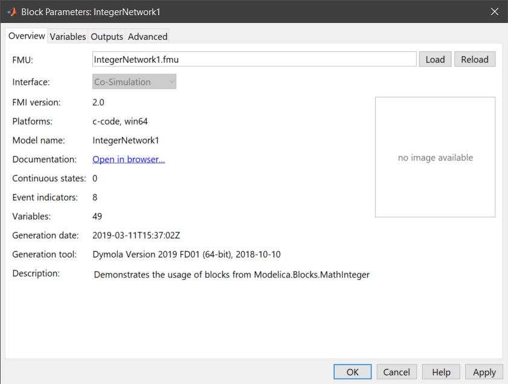
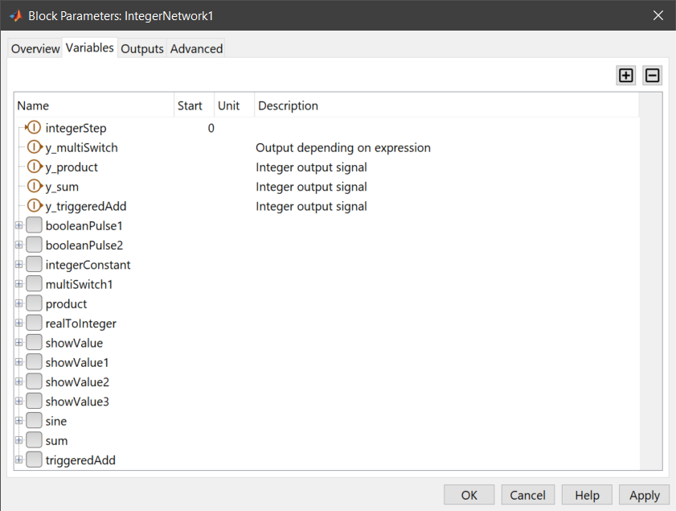
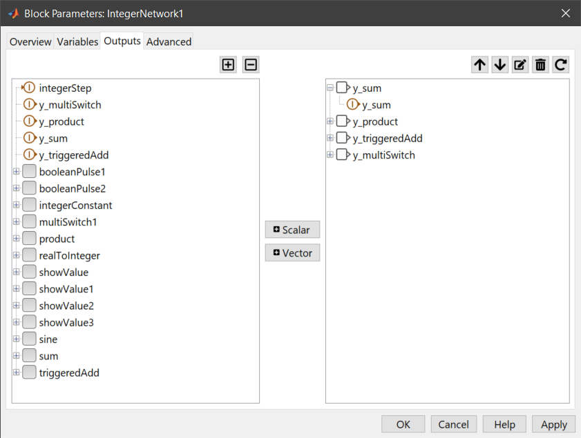
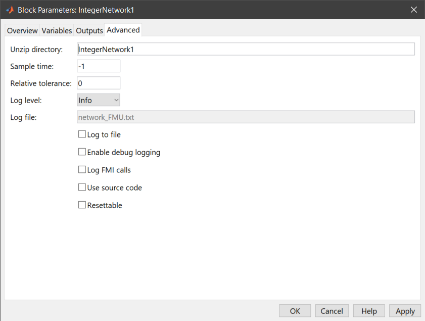

# FMU Import

The following sections describe how to import and configure FMUs in Simulink models with FMI Kit.

## Add an FMU to a Model

1. open the Simulink library browser (**View > Library Browser**) and drag the **FMU** block from the **FMI Kit** library into your model
2. double-click the **FMU** block
3. click the **Load** button and select the FMU
4. click **OK**



The FMU is automatically extracted to the directory specified under **Advanced > Unzip Directory**. This directory must remain in the same relative path when the model is moved to different directory or machine.

For FMI 2.0 FMUs that support both model exchange and co-simulation the interface type can be selected.

## Variables & Start Values



The **Variables** tab shows all variables of the FMU.
Input variables are marked with an arrow on the left, output variables with an arrow on the right of the icon.

The start value, unit and description of the variable (if provided) are displayed in the **Start**, **Unit** and **Description** columns.

To change the start value of a variable click into the respective field in the **Start** column and enter an expression that evaluates to the respective type of variable. Changed start values are indicated by **bold** text. To reset the start value to its default simply clear the **Start** field.

| Icon | Variable Type | Example
|------|---------------|--------
|  | Real | `2*pi`
|  | Integer | `-11`
|  | Boolean | `true`
|  | Enumeration | `3`
|  | String | `'C:\Temp\Resources'`

To get the start value for the variable `step` for the current block in MATLAB enter

```
step = FMIKit.getStartValue(gcb, 'step')
```

to set the start value enter

```
FMIKit.setStartValue(gcb, 'step', 'true')
```

## Output Ports



By default the block has the output ports defined by the FMU.

* to add a single variable as an output port double-click it in the left view
* to add multiple variables as scalar output ports select the variables in the left view and click **+ Scalar**
* to add multiple variables as a vector output port select the variables in the left view and click **+ Vector**
* to remove output ports select the ports in the right view and click **-**
* to move an item in the right view select it and use the up and down buttons
* to restore the default output ports click the reset button

## Advanced Settings

On the advanced tap you can change additional settings for the FMU block



### Unzip Directory

The folder where the FMU is extracted. The path can be absolute or relative to the model file. To use a custom path change this field before loading an FMU.

### Sample Time

The sample time for the FMU block (use `-1` for inherited)

### Relative Tolerance

The relative tolerance for a Co-Simulation FMU (use `0` for the default tolerance).
For Model Exchange FMUs the relative tolerance is the value `RelTol` for variable step and `0` for fixed step solvers.

### Log Level

The lowest status code that is logged.

### Log File

Redirect the log messages to this file if `Log to File` is checked.

### Enable Debug Logging

Enable the FMU's debug logging.

### Log FMI calls

Log all FMI calls to the FMU.

### Use Source Code

If checked a source S-function `sfun_<model_name>.c` is generated from the FMU's source code which gets automatically compiled when the `Apply` or `OK` button is clicked. For FMI 1.0 this feature is only available for FMUs generated with Dymola 2016 or later.

With source code FMUs it is also possible to use FMUs in Rapid Accelerator mode and create target code for RSIM, GRT, ds1005, ds1006 Scalexio platforms.

## MATLAB Commands

### Get the Model Description

Use `FMIKit.getModelDescription()` to retrieve information about an FMU without loading or extracting it.

```
md = FMIKit.getModelDescription('BooleanNetwork1.fmu')
```

### Get Start Values

Use `FMIKit.getStartValue()` to get the start values of an FMUs variables:

```
step = FMIKit.getStartValue(gcb, 'step')
```

### Set Start Values

To set the start values for one or more variables use `FMIKit.setStartValue()`.

```
FMIKit.setStartValue(gcb, 'step', true, 'y', 'sqrt(2)')
```

sets the start value of variable `step` to `true` and `y` to `sqrt(2)`. Start values can be `logical`, `double`, `int32` or expressions.

```
FMIKit.setStartValue(gcb, 'step', [])
```

resets the start value of variable `step` to its default start value.

```
FMIKit.setStartValue(gcb, 'u', [1 2 3]')
```

sets the variables `u[1] = 1`, `u[2] = 2` and `u[3] = 3`.

```
FMIKit.setStartValue(gcb, 'table', [1 2 3; 4 5 6])
```

sets the variables `table[1,1] = 1` ... `table[2,3] = 6`.

### Load FMUs

With `FMIKit.loadFMU()` an FMU can be (re)loaded by the FMU block.

```
FMIKit.loadFMU(gcb, 'Controller.fmu')
```

loads the FMU `Controller.fmu` into the current FMU block.

### Change the Output Ports

Use `FMIKit.setOutputPorts()` to change the output ports of an FMU block.
The following commands add the variable `x` as a `1x1` output port `out1` and the variables `y1` and `y2` as a `2x1` output port `out2` to the current block.

```
ports.label = 'out1';
ports.variables = { 'x' };
ports(2).label = 'out2';
ports(2).variables = { 'y1', 'y2' };

FMIKit.setOutputPorts(gcb, ports)
```

### Use Source Code

Use `FMIKit.setSourceCode()` to use FMU's source code (if available):

```
FMIKit.setSourceCode(gcb, true)
```

### Set the Relative Tolerance

Use `FMIKit.setRelativeTolerance()` to set the relative tolerance for the embedded solver of a Co-Simulation FMU:

```
FMIKit.setRelativeTolerance(gcb, '1e-3')
```

## Calling sequence

The S-function `sfun_fmurun` associated to the `FMU` block loads and connects the FMU to [Simulink's simulation loop](https://www.mathworks.com/help/simulink/sfg/how-the-simulink-engine-interacts-with-c-s-functions.html) by setting its inputs and retrieving its outputs.
The S-function's `mdl*` callbacks in which the respective FMI functions are called depend on the interface type of the FMU and are described below.

### Co-Simulation calling sequence

For Co-Simulation all input variables are set in [mdlUpdate](https://www.mathworks.com/help/simulink/sfg/mdlupdate.html) and all output variables are retrieved in [mdlOutputs](https://www.mathworks.com/help/simulink/sfg/mdloutputs.html).
[Direct feedthrough](https://www.mathworks.com/help/simulink/sfg/sssetinputportdirectfeedthrough.html) is disabled for all input ports.

### Model Exchange calling sequence

For Model Exchange direct feedthrough is enabled for an input port if any output variable declares a dependency on the corresponding input variable in the `<ModelStructrue>`.
If any internal variable is added to the outputs of the FMU block direct feedthrough is enabled for all input ports.
Input variables with [direct feedthrough](https://www.mathworks.com/help/simulink/sfg/sssetinputportdirectfeedthrough.html) enabled are set in [mdlDerivatives](https://www.mathworks.com/help/simulink/sfg/mdlderivatives.html?searchHighlight=mdlDerivatives), [mdlZeroCrossings](https://www.mathworks.com/help/simulink/sfg/mdlzerocrossings.html) and  [mdlOutputs](https://www.mathworks.com/help/simulink/sfg/mdloutputs.html).
In [mdlUpdate](https://www.mathworks.com/help/simulink/sfg/mdlupdate.html) all input variables are set.

## UserData struct

The information from the block dialog is stored in the parameter `UserData` of the FMU block:

```
>> ud = get_param(gcb, 'UserData')

ud =

      fmiKitVersion: '2.4'
            fmuFile: 'Rectifier.fmu'
    fmuLastModified: 1.5548e+12
     unzipDirectory: 'Rectifier'
          runAsKind: 1
         sampleTime: '-1'
         inputPorts: [0x0 struct]
        outputPorts: [1x4 struct]
        startValues: [0x1 containers.Map]
       debugLogging: 0
   errorDiagnostics: 'ignore'
      useSourceCode: 0
       setBlockName: 0
       functionName: 'sfun_fmurun'
         parameters: [1x252 char]

>> ud.outputPorts(2)

ans =

        label: 'iAC'
    variables: {'iAC[1]'  'iAC[2]'  'iAC[3]'}
```

| Field               | Type             | Description                                                      |
|---------------------|------------------|------------------------------------------------------------------|
| `fmiKitVersion`     | `char`           | FMI Kit version that imported the FMU                            |
| `fmuFile`           | `char`           | Path to the imported FMU                                         |
| `fmuLastModified`   | `double`         | Last modification data of the FMU                                |
| `unzipDirectory`    | `char`           | Path to the extracted FMU                                        |
| `runAsKind`         | `int`            | The FMI Type of the FMU (0 = Model Exchange, 1 = Co-Simuliation) |
| `sampleTime`        | `char`           | The sample time of the block                                     |
| `relativeTolerance` | `char`           | Relative tolerance for the solver of co-simulation FMUs          |
| `inputPorts`        | `struct`         | Struct that holds the input ports and associated variables       |
| `outputPorts`       | `struct`         | Struct that holds the output ports and associated variables      |
| `startValues`       | `containers.Map` | Map of variable names -> start values                            |
| `debugLogging`      | `bool`           | Enable debug logging on the FMU instance                         |
| `errorDiagnostics`  | `char`           | Diagnostics level ('ignore', 'warning', 'error')                 |
| `useSourceCode`     | `bool`           | Compile the FMU from source code                                 |
| `functionName`      | `char`           | Name of the S-function                                           |
| `parameters`        | `char`           | Parameters for the S-function                                    |
