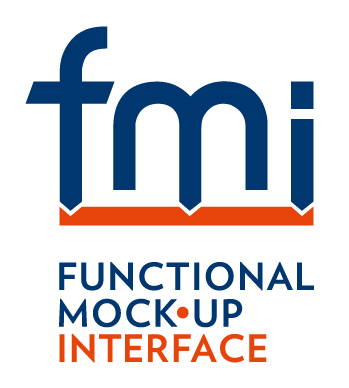

<h1 class="title">FMI Kit</h1>

Import and export Functional Mock-up Units (FMUs)

FMI Kit is a Simulink toolbox to import and export Functional Mock-up Units (FMUs) that conform to the [FMI&nbsp;Standard](https://fmi-standard.org/).
It provides an S-Function with a graphical user interface and a MATLAB API that can import existing binary or C code FMUs into Simulink and set parameters and options.
It also contains two TLC targets for [Simulink&nbsp;Coder](https://www.mathworks.com/products/simulink-coder.html) to export Simulink models as FMUs that can be imported into [100+](https://fmi-standard.org/tools/) third-party applications that support FMI.
FMI Kit supports...

- FMI 1.0 and 2.0
- Model Exchange and Co-Simulation
- binary and C code FMUs
- MATLAB R2012b - R2019a

For updates visit the [project on GitHub](https://github.com/CATIA-Systems/FMIKit-Simulink).

### [FMU Import](fmu_import.html)

Add FMUs to Simulink models using the FMU library block

### [FMU Export](fmu_export.html)

Create FMUs from Simulink models (requires [Simulink Coder](https://mathworks.com/products/simulink-coder.html))

## License

Copyright &copy; 2019 Dassault Syst&egrave;mes.
The code is released under the 2-Clause BSD license.
